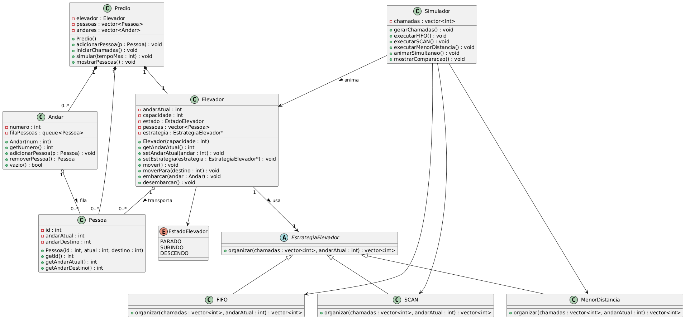

# Simulador de Elevador

Projeto desenvolvido para a disciplina de **Programação Orientada a Objetos II (POO II)** do **Instituto Federal Catarinense (IFC)**.

O projeto consiste em um simulador de elevadores desenvolvido em **C++**, cujo objetivo é representar o funcionamento de um elevador em um prédio utilizando diferentes estratégias de atendimento. A aplicação compara o desempenho de cada estratégia utilizando exatamente a mesma sequência de chamadas, permitindo analisar a eficiência de cada algoritmo.

<p align="center">
  
</p>

---

# Objetivos

O projeto foi desenvolvido para aplicar os principais conceitos de Programação Orientada a Objetos, incluindo:

- Classes e Objetos
- Encapsulamento
- Herança
- Polimorfismo
- Classes Abstratas
- Composição
- Modularização
- Strategy Pattern
- Manipulação de arquivos
- Utilização da STL (Standard Template Library)

Além disso, o projeto busca demonstrar diferentes formas de escalonamento de chamadas em um sistema de elevadores.

---

# Funcionalidades

O simulador possui as seguintes funcionalidades:

- Geração aleatória das chamadas do elevador;
- Definição aleatória do andar inicial;
- Comparação entre diferentes estratégias de atendimento;
- Exibição da ordem de atendimento das chamadas;
- Contagem do número de movimentações realizadas;
- Exibição do estado atual do elevador (Subindo, Descendo ou Parado);
- Representação visual do prédio e da posição do elevador no terminal;
- Registro automático do histórico das simulações em arquivo CSV.

---

# Estratégias Implementadas

O sistema compara três algoritmos de atendimento.

| Estratégia | Descrição |
|------------|-----------|
| **FIFO (First In, First Out)** | Atende as chamadas exatamente na ordem em que foram geradas. |
| **SCAN** | Atende as chamadas percorrendo os andares em uma direção antes de inverter o sentido. |
| **Menor Distância** | Sempre atende primeiro a chamada mais próxima do andar atual do elevador. |

Todas as estratégias recebem exatamente a mesma sequência de chamadas, tornando a comparação imparcial.

---

# Estrutura do Projeto

```text
Elevador/
│
├── Classes/
│   ├── *.h
│   └── Estratégias
│
├── Andar.cpp
├── Elevador.cpp
├── Pessoa.cpp
├── Predio.cpp
├── main.cpp
├── historico_simulacoes.csv
├── diagrama.png
└── README.md
```

---

# Como a Simulação é Executada

Ao iniciar o programa, é gerada automaticamente uma sequência de chamadas para diferentes andares do prédio.

Exemplo:

```text
Chamadas geradas aleatoriamente:

5 6 3 5 6 4 6 5 6 1 7 1 3 5 4
```

Essa mesma sequência é utilizada por todas as estratégias.

Cada algoritmo executa os seguintes passos:

1. Inicializa o elevador no andar inicial definido pela simulação;
2. Organiza a sequência de atendimento conforme sua estratégia;
3. Move o elevador entre os andares;
4. Atualiza o estado do elevador;
5. Conta o número de movimentações realizadas;
6. Exibe a posição do elevador em tempo real;
7. Armazena os resultados da execução.

Ao final da simulação são apresentados:

- Estratégia utilizada;
- Estado do elevador;
- Quantidade de movimentações;
- Ordem de atendimento das chamadas;
- Representação gráfica do elevador;
- Histórico salvo em arquivo CSV.

---

# Fluxo da Simulação

```text
Início
   │
   ▼
Gerar chamadas aleatórias
   │
   ▼
Executar FIFO
   │
   ▼
Executar SCAN
   │
   ▼
Executar Menor Distância
   │
   ▼
Comparar os resultados
   │
   ▼
Salvar histórico (.csv)
   │
   ▼
Fim
```

---

# Representação da Simulação

Durante a execução, o terminal apresenta informações como:

- Andar atual do elevador;
- Estado do elevador (Subindo, Descendo ou Parado);
- Número de movimentações realizadas;
- Ordem de atendimento das chamadas;
- Comparação entre as três estratégias;
- Representação gráfica da posição do elevador dentro do prédio.

Essa visualização facilita o entendimento do comportamento de cada algoritmo durante a simulação.

---

# Histórico das Simulações

Ao término de cada execução é gerado automaticamente o arquivo:

```text
historico_simulacoes.csv
```

O arquivo registra informações importantes sobre cada simulação, permitindo comparar posteriormente o desempenho das estratégias implementadas.

---

# Tecnologias Utilizadas

- C++
- Programação Orientada a Objetos
- STL (vector, queue, algorithm)
- Manipulação de arquivos CSV
- Git
- GitHub

---

# Como Executar

Clone o repositório:

```bash
git clone https://github.com/MariaOdorizzi/Elevador.git
```

Acesse a pasta do projeto:

```bash
cd Elevador
```

Compile o projeto:

```bash
g++ *.cpp Classes/*.cpp -o elevador
```

> Caso todos os arquivos `.cpp` estejam na pasta principal, utilize:

```bash
g++ *.cpp -o elevador
```

Execute:

**Linux**

```bash
./elevador
```

**Windows**

```bash
elevador.exe
```

---

# Exemplo de Execução

```text
COMPARAÇÃO DAS ESTRATÉGIAS

Andar inicial: 3

Chamadas geradas aleatoriamente:
5 6 3 5 6 4 6 5 6 1 7 1 3 5 4

------------------------------------------------------------
FIFO            SCAN             MENOR DISTÂNCIA
------------------------------------------------------------

Estado: SUBINDO     Estado: DESCENDO     Estado: DESCENDO

Movimentos:
FIFO : 27
SCAN : 18
MENOR: 18

FIFO :
3 -> 5 -> 6 -> 3 -> 5 -> 6 -> ...

SCAN :
3 -> 3 -> 4 -> 5 -> 5 -> 5 -> ...

MENOR DISTÂNCIA :
3 -> 3 -> 4 -> 4 -> 5 -> 5 -> ...

[8] |
[7] |
[6] |
[5] |
[4] |
[3] | E
[2] |
[1] |
[0] |

Histórico salvo no arquivo:
historico_simulacoes.csv
```

---

# Diagrama UML

O sistema foi modelado utilizando UML antes da implementação, permitindo definir a estrutura das classes, seus relacionamentos e responsabilidades.

<p align="center">
  
</p>

---

# Aprendizados

Durante o desenvolvimento deste projeto foram aplicados conhecimentos relacionados a:

- Modelagem Orientada a Objetos;
- Organização de projetos em múltiplos arquivos;
- Reutilização de código;
- Polimorfismo e Herança;
- Classes Abstratas;
- Padrão de Projeto Strategy;
- Manipulação de filas e vetores;
- Simulação de eventos;
- Comparação entre algoritmos;
- Geração e armazenamento de dados em arquivos CSV.

---

# Vídeo
Vídeo editado no canvas pela estudante e publicado no YouTube
link: https://youtu.be/6GjxBrIoFr4

# Desenvolvido por

**Maria Eduarda Odorizzi**

**Disciplina:** Programação Orientada a Objetos II

**Curso:** Bacharelado em Ciência da Computação

**Instituto Federal Catarinense (IFC)**

---

## Licença

Este projeto foi desenvolvido exclusivamente para fins acadêmicos como requisito da disciplina de **Programação Orientada a Objetos II**.
